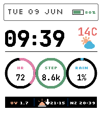
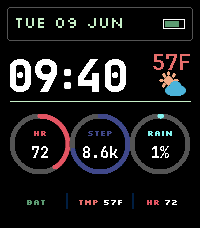

# Signal Deck

Signal Deck is a configurable Pebble Time 2 watchface for the 200x228 Emery display. It uses a compact aviation-dashboard layout with live weather, health telemetry, battery status, world clock, sun event timing, and light/dark themes.




## Features

- Light and dark modes
- Custom Pebble-friendly fonts for crisp low-resolution rendering
- PDC vector weather and sun-event icons
- Configurable 12h/24h time mode
- Celsius/Fahrenheit temperature display
- Configurable step goal and age-based heart-rate gauge scaling
- Configurable world clock preset
- Configurable footer cells
- Configurable HR, steps, and rain accent colors
- Optional demo fallback values for emulator screenshots
- Optional weather, health, and battery percentage visibility

## Build

```sh
pebble build
```

The PBW is generated at `build/signal-deck.pbw`.

## Target

- Pebble Time 2 / Emery
- 200x228 color e-paper display

## Third-Party Licenses

Signal Deck bundles JetBrains Mono and Silkscreen font files. See
[THIRD_PARTY_LICENSES.md](THIRD_PARTY_LICENSES.md) for copyright notices and
the SIL Open Font License text.
